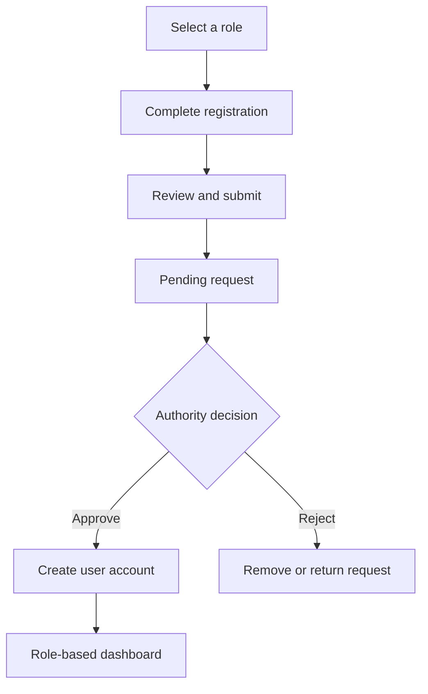

# Land & Workforce Management System

A full-stack web platform that connects **landowners**, **workers**, and **authorities**. It provides role-based registration and dashboards, helps landowners and workers coordinate, and allows authorities to review pending registration requests before approval.

## Overview

The application supports three user roles:

- **Landowner** — manages profile information and work-related requests.
- **Worker** — creates a professional profile and views available opportunities.
- **Authority** — reviews pending registrations and approves or rejects requests.

New registration data can first be stored in a pending collection. After an authority approves the request, the user is added to the appropriate main collection.

## Key Features

- Role selection for Landowner, Worker, and Authority
- Multi-step registration forms with progress tracking
- Client-side and server-side form validation
- Registration review before final submission
- JWT-based authentication using access and refresh tokens
- Secure cookie support
- Role-based dashboards and navigation
- Authority approval and rejection workflow
- Responsive interface built with Tailwind CSS
- REST API integration with Axios
- MongoDB data storage using Mongoose

## Tech Stack

### Frontend

- Next.js
- React
- TypeScript
- Tailwind CSS
- Axios
- React Hook Form
- Zod
- Framer Motion
- Context API

### Backend

- Node.js
- Express.js
- MongoDB
- Mongoose
- JSON Web Tokens (JWT)
- bcrypt
- CORS
- dotenv

## Application Workflow



## Project Structure

```text
project-root/
├── frontend/                 # Next.js client application
│   ├── app/                  # Pages, layouts, and routes
│   ├── components/           # Reusable UI components
│   ├── context/              # Registration and shared state
│   ├── hooks/                # Custom React hooks
│   ├── lib/                  # API clients and utilities
│   ├── public/               # Images and static assets
│   └── types/                # TypeScript types and interfaces
│
├── backend/                  # Express API server
│   ├── controllers/          # Request-handling logic
│   ├── middleware/           # Authentication and error handling
│   ├── models/               # Mongoose models and schemas
│   ├── routes/               # API route definitions
│   ├── utils/                # Helper functions
│   └── index.js              # Server entry point
│
└── README.md
```

> Adjust the structure above if your current folder names are different.

## Getting Started

### Prerequisites

Install the following before running the project:

- [Node.js](https://nodejs.org/) 18 or newer
- npm
- [MongoDB](https://www.mongodb.com/) locally or a MongoDB Atlas account
- Git

### 1. Clone the repository

```bash
git clone https://github.com/YOUR_USERNAME/YOUR_REPOSITORY.git
cd YOUR_REPOSITORY
```

### 2. Install frontend dependencies

```bash
cd frontend
npm install
```

### 3. Install backend dependencies

```bash
cd ../backend
npm install
```

## Environment Variables

Create a `.env` file inside the `backend` directory:

```env
PORT=5000
MONGODB_URI=your_mongodb_connection_string
ACCESS_TOKEN_SECRET=your_access_token_secret
ACCESS_TOKEN_EXPIRY=15m
REFRESH_TOKEN_SECRET=your_refresh_token_secret
REFRESH_TOKEN_EXPIRY=7d
CORS_ORIGIN=http://localhost:3000
```

Create a `.env.local` file inside the `frontend` directory:

```env
NEXT_PUBLIC_API_URL=http://localhost:5000/api
```

Do not commit `.env` or `.env.local` files to GitHub.

## Running the Application

Start the backend server:

```bash
cd backend
npm run dev
```

In a second terminal, start the frontend:

```bash
cd frontend
npm run dev
```

Open [http://localhost:3000](http://localhost:3000) in your browser.

## Available Scripts

### Frontend

```bash
npm run dev      # Start the development server
npm run build    # Create a production build
npm run start    # Run the production build
npm run lint     # Check the code for linting issues
```

### Backend

```bash
npm run dev      # Start the server with automatic reloading
npm start        # Start the production server
```

The exact backend scripts depend on the entries in `backend/package.json`.

## Registration Process

1. The user selects Landowner, Worker, or Authority.
2. The relevant multi-step form is displayed.
3. Each step validates its fields before allowing the user to continue.
4. The user reviews the complete form and submits it.
5. The backend stores the request as pending.
6. An authority approves or rejects the request.
7. An approved user can sign in and access the appropriate dashboard.

## Authentication

The backend uses an access token and a refresh token:

- The **access token** authorizes protected API requests.
- The **refresh token** creates a new access token when the current one expires.
- Tokens can be sent through secure, HTTP-only cookies.
- Protected routes verify the token and the user's role before returning data.

## API Areas

The API is organized around the following resources:

- Authentication and token refresh
- Landowner registration and profile data
- Worker registration and profile data
- Authority registration and profile data
- Address information
- Pending registration requests
- Registration approval and rejection

Document the exact route paths here as the backend API is finalized.

## Screenshots

Add project screenshots inside `frontend/public/screenshots/`, then replace the placeholders below:

```md


```

## Roadmap

- [ ] Complete dashboards for all three roles
- [ ] Add search and filtering for requests
- [ ] Add notifications for registration status
- [ ] Add profile and document upload support
- [ ] Improve accessibility and mobile responsiveness
- [ ] Add automated frontend and backend tests
- [ ] Deploy the frontend, backend, and database

## Security Notes

- Hash passwords before storing them.
- Validate all request data on the backend.
- Restrict protected routes by authentication and role.
- Use HTTP-only, secure cookies in production.
- Keep secrets in environment variables.
- Allow only trusted frontend origins through CORS.
- Never store sensitive documents directly in the repository.

## Contributing

1. Fork the repository.
2. Create a feature branch:

   ```bash
   git checkout -b feature/your-feature-name
   ```

3. Commit your changes:

   ```bash
   git commit -m "Add your feature"
   ```

4. Push the branch:

   ```bash
   git push origin feature/your-feature-name
   ```

5. Open a pull request.

## Author

**Hariom Kumar**

- GitHub: [Add your GitHub profile](https://github.com/YOUR_USERNAME)
- LinkedIn: [Add your LinkedIn profile](https://www.linkedin.com/)

## License

This project is intended for educational and development purposes. Add a license such as the [MIT License](https://opensource.org/license/mit) if you plan to distribute it publicly.

